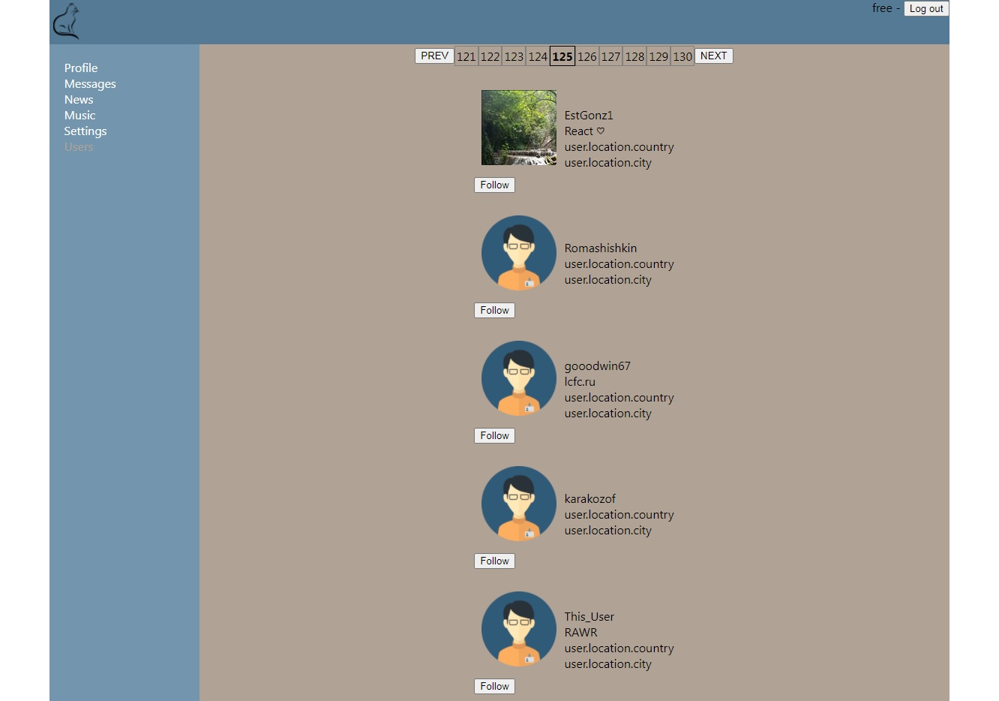

# Демоверсия социальной сети

## Функционал

+ Авторизация с помощью электронной почты.  
__Тестовый аккаунт__  
__Электронная почта: free@samuraijs.com__  
__Пароль: free__                                                           

+ В случае неверного введения пароля 5 раз появляется капча.

+ Просмотр разделов Profile, Messages и Users могут осуществлять только авторизованные пользователи.

+ Загрузка данных пользователей с сервера.

+ Пользователи выводятся в количестве десяти на страницу, присутствует пагинация. 

+ Вывод информации о пользователях по клику на профиль.

+ Возможность подписки/отписки по клику на кнопку follow/unfollow.

+ Возможность редактирования данных профиля собственного аккаунта.

+ Используется тестирование компонентов.

### Используемые технологии и инструменты: 
* React
* Redux
* Redux-Thunk
* Css Modules
* Библиотека Axios

### Просмотр работы кода: https://yuliyabaskakova3012.github.io/demo-social-network/#/login
